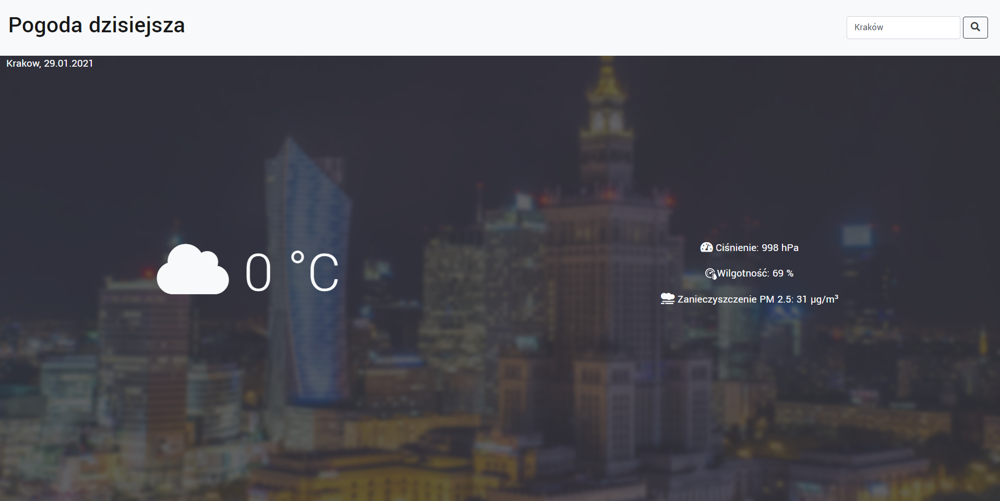

# Weather App

## Table of contents
* [General info](#general-info)
* [Apperance](#how-does-it-looks-like?)
* [Features](#features)
* [Technologies](#technologies)
* [Sources](#sources)

## General info
This is Weather app showing current weather in your localization or searched city. Website is using Geolocation API to detect user localization. Searching is also possible by using postal code instead of city name.
## How does it looks like?
	
## Features
* Clear and simple design
* Fast weather info
* Automatically getting weather in your current localization
* Live update
## Technologies
Project is created with:
* HTML5
* CSS
* JavaScript
* Airly API
* Openweather API
* Zipcodebase API
* Geolocation API

## Sources
https://airly.org/en/products/airly-api/
https://zipcodebase.com/
https://openweathermap.org/api

